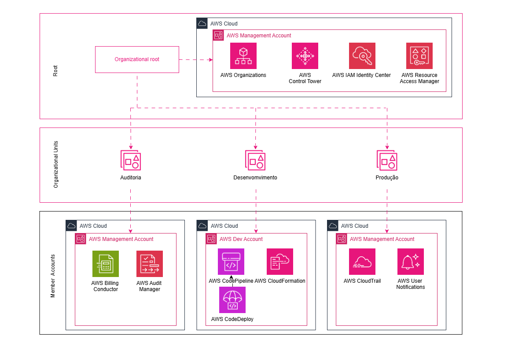

# 🏗️ AWS Organizations – Arquitetura Multi-Contas com Governança e Segurança

Este projeto apresenta a **estrutura completa de uma organização AWS** utilizando **AWS Organizations** e **IAM Identity Center**, com foco em **governança, segurança, separação de ambientes e boas práticas corporativas**.

A arquitetura foi desenhada para simular um **ambiente real de empresa**, separando responsabilidades por contas e Unidades Organizacionais (OUs), facilitando o controle de acessos, custos, auditoria e escalabilidade.

---

## 🎯 Objetivo do Projeto

O principal objetivo deste projeto é:

- Criar uma **estrutura multi-contas na AWS**
- Aplicar **boas práticas de governança**
- Centralizar **acessos e permissões**
- Facilitar **auditoria, segurança e controle de custos**
- Demonstrar um **ambiente profissional pronto para produção**

---

## 🧠 Visão Geral da Arquitetura

A organização AWS é composta por uma **conta de gerenciamento (Management Account)** e múltiplas **Unidades Organizacionais (OUs)**, cada uma com uma função específica dentro do ambiente.

### 🔝 Estrutura de Alto Nível

- **Root**
  - Auditoria
  - Desenvolvedores
  - Produção

Cada OU agrupa contas com responsabilidades semelhantes, permitindo a aplicação de políticas e controles específicos.

📌 *Exemplo visual da organização:*

---

## 🧩 Unidades Organizacionais (OUs)

### 🔐 Auditoria
Responsável por atividades de:
- Auditoria
- Logs
- Monitoramento
- Compliance

Normalmente utilizada para serviços como:
- AWS CloudTrail
- AWS Config
- Logs centralizados
- Auditorias de segurança

---

### 🧪 Desenvolvedores
Ambiente destinado a:
- Desenvolvimento
- Testes
- QA
- CI/CD

Aqui ficam contas utilizadas para:
- AWS CodePipeline
- AWS CodeBuild
- AWS CloudFormation
- Testes de aplicações e infraestrutura

---

### 🚀 Produção
Ambiente crítico onde ficam:
- Aplicações em produção
- Serviços finais para clientes
- Monitoramento e alertas

Conta altamente protegida com foco em:
- Alta disponibilidade
- Segurança
- Controle rigoroso de acesso

---

## 👥 IAM Identity Center (SSO)

O **IAM Identity Center** foi integrado à organização para permitir:

- Login único (SSO)
- Gerenciamento centralizado de usuários e grupos
- Atribuição de permissões por conta e por OU
- Eliminação de usuários IAM locais nas contas

📌 *Visão da integração do IAM Identity Center com a organização:*

---

## 🔐 Segurança e Governança

Este projeto foi pensado para aplicar conceitos importantes como:

- **Separação de ambientes**
- **Princípio do menor privilégio**
- **Governança centralizada**
- **Auditoria e rastreabilidade**
- **Redução de riscos operacionais**

O uso de **AWS Organizations** permite futuramente aplicar:
- Service Control Policies (SCPs)
- Restrições de regiões
- Bloqueio de ações críticas
- Padronização de serviços

---

## 💰 Billing e Controle de Custos

Todas as contas fazem parte de uma única organização, permitindo:

- **Billing centralizado**
- Visão consolidada de custos
- Aplicação de práticas FinOps
- Melhor previsibilidade financeira

---

## 🛠️ Tecnologias Utilizadas

- AWS Organizations
- IAM Identity Center (SSO)
- AWS IAM
- AWS CloudTrail
- AWS CloudFormation
- AWS Code Services (Dev)
- Boas práticas de Cloud Governance

---

## 📌 Status do Projeto

✅ Estrutura organizacional criada  
✅ OUs definidas  
✅ IAM Identity Center integrado  
✅ Contas associadas corretamente  
🚧 Evolução contínua com políticas SCP e automações  

---

## 📽️ Conteúdo Relacionado

Este projeto faz parte de um conteúdo educacional, onde explico a arquitetura e decisões técnicas em vídeo no YouTube.

👉 Em breve: vídeo explicando toda a estrutura passo a passo.

---

## ✍️ Autor

**Luiz Augusto Souza Inhesta**  
Especialista em Infraestrutura & Cloud  
Apaixonado por AWS, DevOps, Segurança e Governança ☁️🚀

---

## ⭐ Contribuições

Sugestões e melhorias são sempre bem-vindas!  
Sinta-se à vontade para abrir issues ou enviar pull requests.

